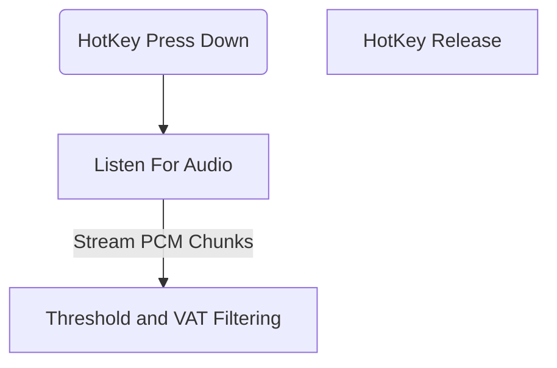

How should the radio work

The same service will look after both incoming and outgoing data streams

- First of all we need a pipeline, a data structure to hold incoming data. 
- The main idea is that the radio layer will query the monitor layer for a "window" to prompt the driver, it will most probably have a shared channel which gives the window to the radio
- Based on that window, the radio sees what all messages we have available 
- Priority 0 messages, like safety car, penalties to you or damage to your car, or pitting information will not wait for the window.
- But fastest lap, fuel mode changes, ers planning all of that has to be communicated in the windows
- Now all we need is 1) the shared channel between the two for windows 
- And obviously a system for finding windows 

So we measure a float, Cognitive Load on the driver
Just a percentage of how much he is taking, and based on that we can filter out priorities
Things that increase it:
- Lateral G Force
- Steering Angle 
- Yaw Rate (Derivative to be found from point to point data)
- Braking
